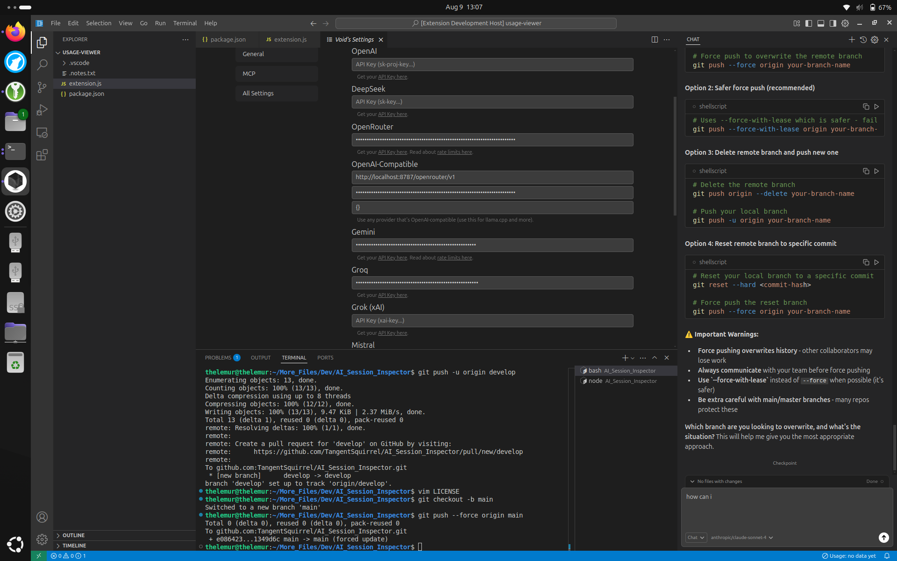
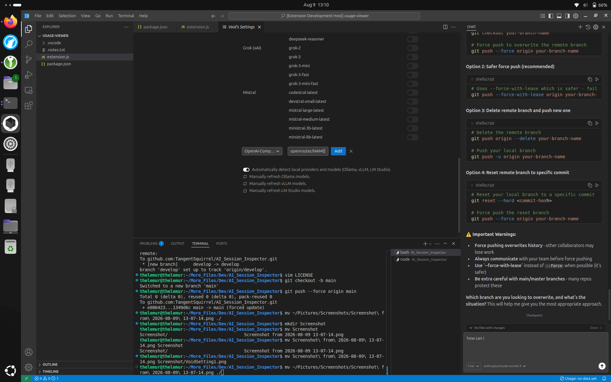
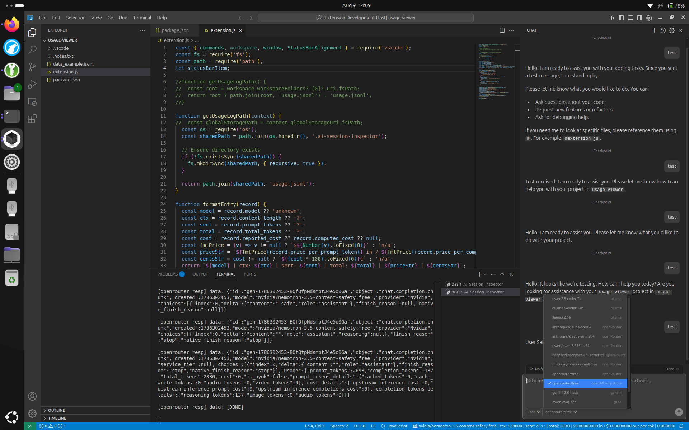

###SETUP

##localhost, developer mode for void, openrouter

#open void in developer mode to run extension from code
void --extensionDevelopmentPath=<whatever>/AI_Session_Inspector/usage-viewer/ <whatever>/AI_Session_Inspector/usage-viewer/

#run node router in term:
node logproxy.js --config targets.json --quiet 2>&1 | tee proxy.log 

#configure void model
Setup OpenAI-Compatible Config, put your openrouter api key in:

Define a model, i recommend openrouter/free for testing:

Check the right of the bottom blue bar for your last stats:

